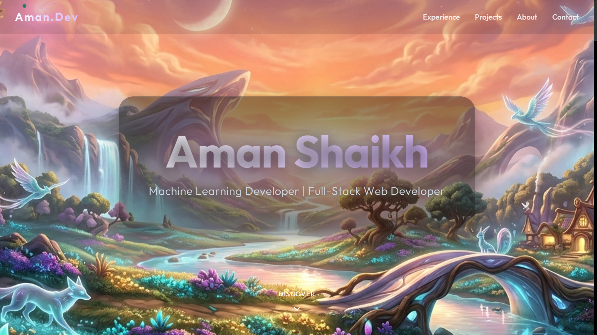

  <h1>Aman Shaikh | Interactive 3D Portfolio</h1>
  
  

    <strong>A visually stunning, immersive, and interactive portfolio designed to showcase a blend of Machine Learning logic and Full-Stack web creativity.</strong>
  

   
  
  

 

## ✦ Core Vision

This portfolio transcends the standard digital resume. Built with a focus on immersive aesthetics and smooth spatial interactions, it leverages **Three.js** and **React-Three-Fiber** to create a dynamic background that reacts to the user's presence. Every element—from the glowing gradients to the frosted glass panels—is crafted to provide a premium, unforgettable user experience. I am a Computer Science student blending the structured logic of Machine Learning with the expansive creativity of Full-Stack Web Development, and this portfolio is the digital embodiment of that intersection.

## ✦ Key Features

- **Immersive 3D Parallax Environment**: A dynamic, reacting spatial environment complete with drifting particles and a cursor-responsive liquid distortion effect.
- **Modern Glassmorphism Design**: High-end frosted glass UI elements that blur the background and create an incredible sense of depth.
- **Cinematic Typography & Accents**: Distinctive glowing accents (`#a855f7`) synchronized perfectly with the portfolio's identity.
- **Smooth Animations**: Masterfully choreographed entrance and interaction animations using Framer Motion.
- **Responsive Navigation**: An intelligent NavBar featuring a graceful background blur and an elegant mobile hamburger overlay menu.
- **Interactive Project Cards**: Refined, highly professional rectangular layout emphasizing visual asset presentation.

## ✦ Technology Stack

- **Framework**: React / Vite
- **Styling**: Tailwind CSS & Vanilla CSS
- **3D Rendering**: Three.js, React Three Fiber (`@react-three/fiber`), React Three Drei (`@react-three/drei`)
- **Animation Engine**: Framer Motion
- **Icons**: Lucide React
- **Typography**: Inter & Outfit (Google Fonts)

## ✦ Get In Touch

Whether you're looking to discuss machine learning, web development, or potential collaborations, my inbox is always open. Let's build something meaningful together.

- **Email**: hello@amaanshaikh.com
- **LinkedIn**: [Aman's LinkedIn](#)
- **GitHub**: [Aman's GitHub](#)

---

  
Crafted with intention by Aman Shaikh.

